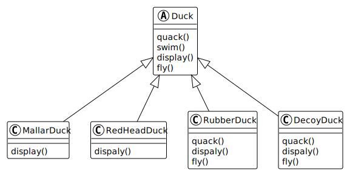
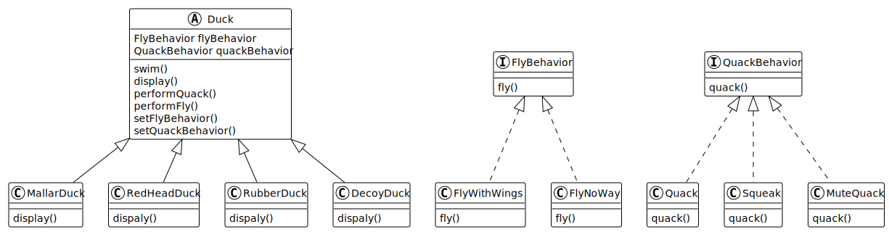

## 鸭子分类

在这里我们有不同类型的鸭子。

| 鸭子        | 游泳 | 外形   | 叫声 | 飞行 |
| :---------- | :--- | :----- | :--- | :--- |
| MallardDuck | 会   | 绿头鸭 | 嘎嘎 | 会   |
| RedheadDuck | 会   | 红头鸭 | 嘎嘎 | 会   |
| RubberDuck  | 会   | 橡皮鸭 | 吱吱 | 会   |
| DecoyDuck   | 会   | 诱饵鸭 | 不会 | 不会 |

## UML

图1.1

<a href="./a">a代码</a>

图1.2

<a href="./b">b代码</a>

图1.3

<a href="./c">c代码</a>

## 问题所在

鸭子有许多种类，且有不同的行为方式。有飞行的鸭子，不可飞行的样子。也有嘎嘎叫声的鸭子，也有吱吱叫的鸭子，也有不会叫的鸭子。

简单说明，父类下有各种子类，不同的子类有许多行为，而子类间的行为有部分相同，也有不同的行为。

## 解决问题方案

图1.4

## 个人观点

策略模式与装饰器模式的区别？

策略模式针对子类，子类间也有不同的行为，但同一类行为之间是互斥的，如鸭子的叫声只可能有一种。而装饰器模式，装饰的子类是不冲突的，如咖啡可以加半勺糖之后再加一勺糖，还可以加上牛奶等。
