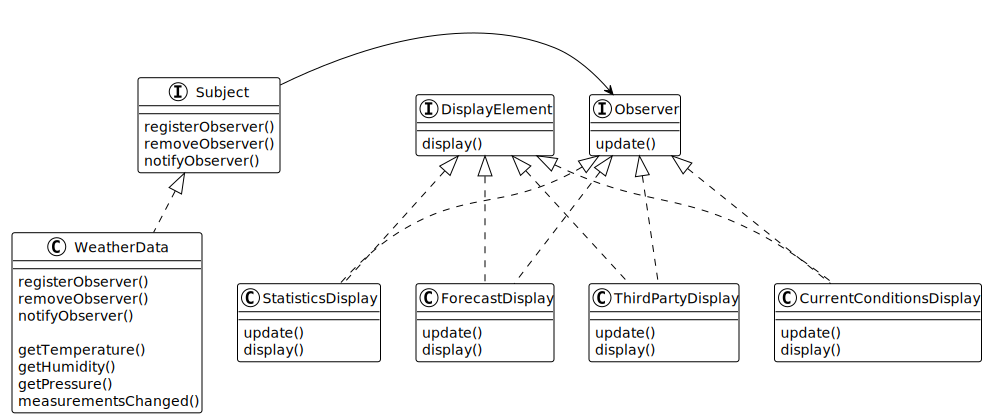
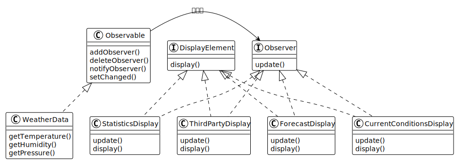

## 基础介绍

气象工作站会发布三个消息：温度（temperature），湿度（humidity）和气压（pressure）。

将这些数据提供给不同类型的布告板，让他们显示不同的效果。分别是“目前状况”，“气象统计”和“天气预告”布告栏。

- 目前状况展示：温度，湿度，气压
- 天气统计展示：平均温度，最低温度，最高温度
- 天气预报展示：天气预报

## UML 和代码

### 实现观察者模式

图a

<a href="./a">a代码</a>

### 使用内置观察者模式

图b

<a href="./b">b代码</a>

