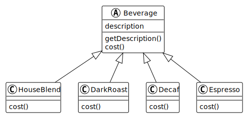
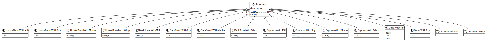
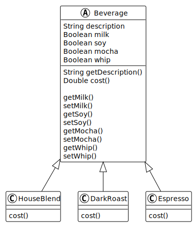
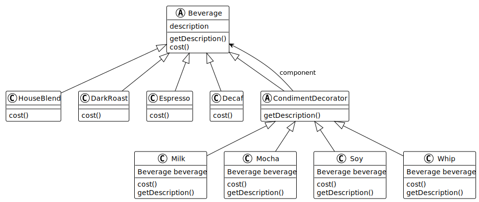

## 介绍说明

咖啡系统有不同的咖啡，且不同的咖啡可以添加不同的调料。

咖啡的种类有：House Blend（家常咖啡），Dark Roast（深培咖啡），Decaf（低因咖啡）以及 Espresso（浓缩咖啡）。

咖啡调料的种类有：Milk（牛奶），Soy（豆浆），Mocha（摩卡）以及 Whip（奶泡）。

## UML 和代码

原有的类 UML 图如下

当我们添加了配料，原有的每种咖啡都可以配上不同的调料，相应的类也成指数倍增。

如果牛奶的价格上涨，所有跟牛奶有关的类都需要修改。而如果新增一种焦糖的调料，那么所有咖啡都要增加对应的调料。如果我们需要两种或者以上的调料，那么相应的类又是倍增。

### 使用实例变量

使用实例变量来设置调料

这样子很好解决了类的爆炸增长问题，但是还是有有一些问题。如：

- 调料的价格改变会让我们改写现有的代码。
- 新的调料增加我们需要修改超类的 cost 方法。
- 不能添加双份一样的调料。

## 装饰器模式

装饰器模式的 UML 图如下

