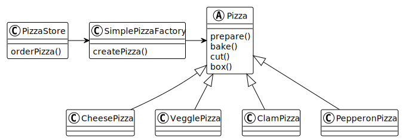

### 工厂模式

## 简单工厂

简单工厂就是将代码中负责创建对象的代码抽离到一个独立的类中，让这个类只处理创建对象的细节。

<a href="./a">代码示例</a>

## 工厂方法

工厂方法模式通过让子类决定该创建的对象是什么，来达到将对象创建的过程封装的目的。

工厂方法模式定义了一个创建对象的接口，但由子类决定实例化的类的是哪一个。工厂方法让类把实例化推迟到子类。

<a href="./b">代码示例</a>

## 抽象工厂

<a href="./c">代码示例</a>

